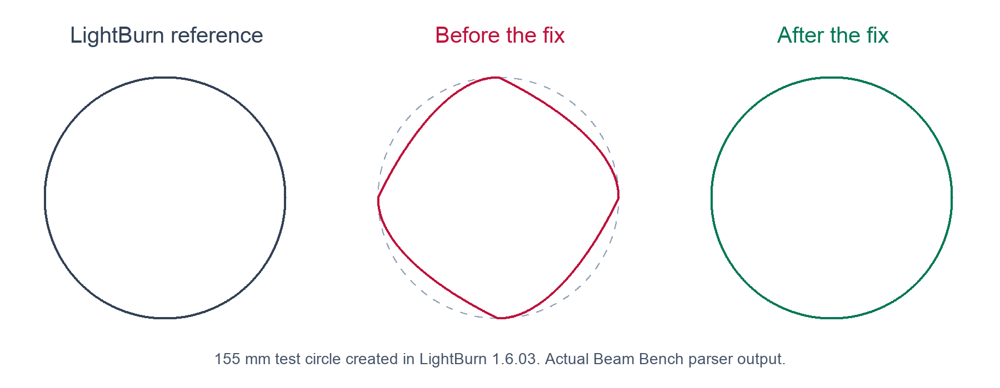

# LightBurn smooth-curve import investigation

Beam Bench discarded the final curve handle on compact LightBurn vertices
ending with the `S` smooth-node marker. The resulting vector geometry was
wrong before rendering or job planning. This can affect line and fill layers
in any `.lbrn2` project using that encoding.

The Facebook medal screenshots prompted this investigation. The original
medal file is still unavailable, so this confirmed defect has not yet been
established as the complete cause of that particular report.

## Reproduction and cause

A 155 mm circle was drawn in LightBurn 1.6.03 on macOS, converted to a path,
and saved as both `.lbrn2` and legacy `.lbrn`. The minimized native files are
in `crates/beambench-core/tests/fixtures/lbrn/`. Both contain the same four
cubic arcs, but only the compact version failed to import faithfully.

For example, `c1y42.802067S` reached the numeric parser as `42.802067S`.
Parsing failed and the incoming handle became absent. Curve construction
then substituted the endpoint for that handle. All four incoming handles
were lost on the test circle. Legacy XML stores the smooth flag separately
as `sm="1"`, so its coordinates imported correctly.

The figure uses actual parser output captured before and after the change.
The corrected path equals the legacy reference exactly, including closure,
endpoints, and control coordinates.

The native saves also confirm the encoding described in the author's
[LightBurn file-format investigation](https://forum.lightburnsoftware.com/t/lbrn2-file-documentation/52174/3).

## Correction and coverage

The compact vertex parser removes the trailing `S` before reading numeric
values. This single change covers all handles and also permits a smooth
marker after a vertex with no explicit handles. It preserves scientific
notation and the existing absent-handle behavior.

Four regression tests were added and confirmed failing before the fix:

- Native `.lbrn2` circle geometry must equal its native `.lbrn` equivalent.
- Smooth markers preserve both handles, either handle alone, absent handles,
  negative and fractional numbers, scientific notation, and trailing whitespace.
- Shared paths preserve smooth handles through nested transforms, including
  a forward reference to the geometry definition.
- The project import API preserves the same closed contour and bounds for
  both Line and Fill operations.

All 17 LightBurn-focused tests pass after the fix. The full core and service
package suites pass 1,757 tests, including integration tests. Rust formatting
and Git whitespace checks pass. Clippy completes successfully with existing
warnings outside the changed lines. No frontend code changed in this fix.

The new tests and native fixtures address the gap in the earlier synthetic
tests, which included curve coordinates but omitted smooth-node markers.
The earlier shared-path fix remains necessary and is covered by both the
existing tests and the new shared-curve regression.

The fix is prepared for release 0.2.21. The customer's original file is still
needed to confirm their exact drawing and check for any additional defect.
